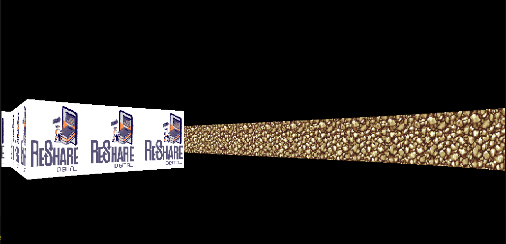

# sdl_test
My simple raycsater implementation on SDL2
# build
You can build it with cmake, no odd flags required.
Make sure that you have installed libsdl2-dev and libsdl2-image-2.0-0.
Tested on Ubuntu 22.04.4 LTS.
# todo
- add sprites
- add npc
- add shooting and death mechanics
- add some game logic
